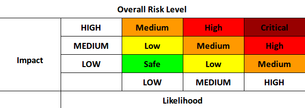

# Design Assurance Level
The *Design Assurance Level* (DAL) is the level of rigor needed to ensure comprehensive
verification of a smart contract's method to a given level of risk.
It is a 5 letter grade score (A, B, C, D, E) that comes with a common set of standards
for how that rigor is obtained. The risk levels are defined according to the OWASP model as:

We define `Likelihood` as the access control level (ACL) of a given method,
and `Impact` as the ability of that method to affect the use or ownership of
valuable assets held in the state of Ethereum. Given a risk level according to the model,
the DAL levels that mitigate those levels of risk with proper verification are:

|   Risk    | DAL |
| :-------: | :-: |
| Critical  |  A  |
| High      |  B  |
| Medium    |  C  |
| Low       |  D  |
| Safe/Info |  E  |

# DAL A
DAL A is the highest level of validation required.
Methods that require DAL A design are given the highest considerations from multiple engineers
to ensure no critical bugs exist. Typically this requires representations at all levels of testing
(functional, integration, system-level, coverage) and MC/DC coverage testing (the most stringent)
to ensure to a high level of confidence that all conditional logic is tested.

All DAL A methods should be traceable all the way to the system-level design goals of the system.

# DAL B
DAL B should be handled similarly to DAL A, but a slight relaxing of the coverage level can be used.

All DAL B methods should be traceable all the way to the system-level design goals of the system.

# DAL C
DAL C should have representations in at least the functional and integration levels of testing.
Coverage is still important, but statement-level coverage is usually sufficient.

All DAL C methods should be traceable at least to requirements derived from the
system-level design goals of the system.

# DAL D
DAL D should have some level of functional testing and integration testing,
but the Low risk here means coverage is of marginal importance.
In practice, statement-level coverage is useful, but not required.

DAL D methods may or may not be traceable to system-level design goals.
These could include "emergency stop" mechanisms or other methods of live fault mitigation.

# DAL E
DAL E, having essentially no risk to the system, means the lowest level of testing rigor is okay.

DAL E methods do not need to be traceable to any system-level design goals,
and can be debugging conviences requested by the designer.
