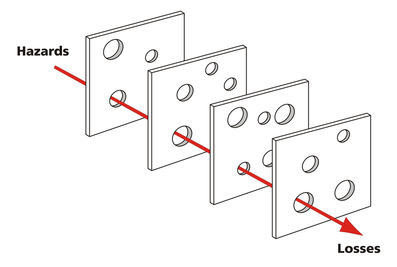

# Testing

## What is Testing?

If you've written software, you've probably done testing before, and you could probably give a pretty good response to the question posed above. A very naive answer to the question is that "Testing proves you did the right thing", but then you would have to define what "the right thing" is. A formal definition for testing often defines two categories of testing: Verification and Validation. [Barry Boehm](https://en.wikipedia.org/wiki/Barry_Boehm) has a widely copied quote that explains this distinction:

> * Validation: Are we building the right product?
> * Verification: Are we building the product right?

### Software Validation

"Building the right product" has to do with defining what your goals are

### Software Verification

"Building the product right" is more along the lines of what everyone typically thinks of when someone mentions Testing.

## Why Do All This Testing?

Think of your testing strategy as a block of Swiss cheese. For reference, here is a block of Swiss cheese:

Now think of a slice of this cheese. Like this slice of cheese, each of your test cases has holes in it's coverage of the functionality you are testing. Intuition would state that the more test cases you write, the less likely there is to be a catastrophic defect that goes untested. However, as a human, you have have a limited understanding of all of the nuances of the requirements, and how those logical decisions work together. A good next step is to ensure you get other perspectives on this system, as well as other types of verification and validation. Over time, you layer so many layers of ~~Swiss cheese~~ verification on top of one another, and a malicious actor will be very statistically unlikely to find a catastrophic hazard and make you or your customers encounter losses. This is illustrated by the following picture:

## How Do I Manage Testing?

So, there's a lot of testing that needs to get done, that much is obvious. How do I manage all of it? How do I prevent development churn so my team doesn't suffer under the oppressive weight of all this verification?

### Requirements Traceability

Ensure all your functional test cases map to a requirement. [Traceability Matrixes](traceability.md) can help you find any missing or incomplete traceability, and [Peer Reviews](peer-reviews.md) can help you find mistakes in your test traceability

### Test Driven Development

### Continuous Integration

### Coverage Testing

