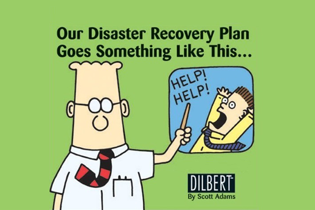

# Mitigation Plan

How to respond when things go wrong...

Know what to do at a high level instead of guessing in the moment

##  

Got a comment?  Check out our [Gitter Channel](https://gitter.im/SecurEth_Guidelines/community#)!

Copyright and related rights waived via [CC0](https://creativecommons.org/publicdomain/zero/1.0/)

